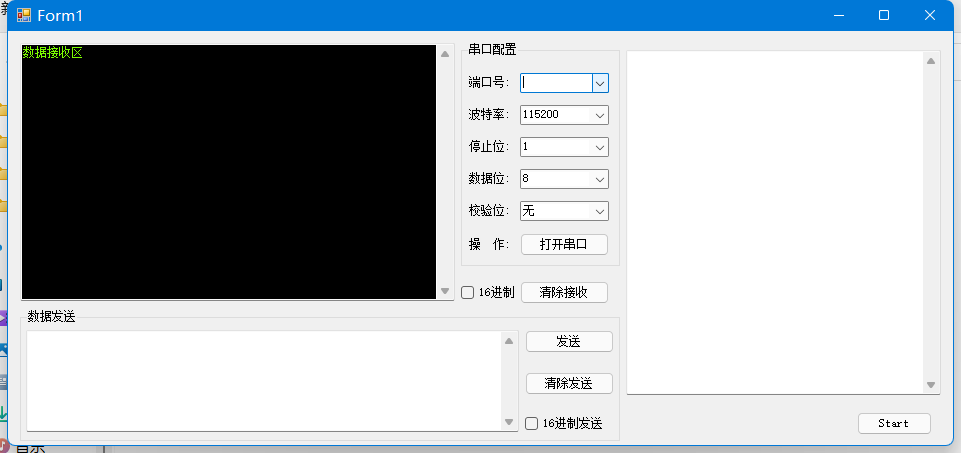

## 原神钓鱼辅助工具（无需管理员权限版本）

+ 演示

+ 原理

  采用ESP32充当蓝牙鼠标来发送点击事件

  使用串口给ESP32发送数据

+ 注意事项

  请先配置打包的main.exe的位置

  

+ 使用方法

  

  1. 刷入程序
  2. 连接至电脑
  3. 用蓝牙连接该设备
  4. 选择串口号
  5. 打开串口
  6. 点击start
  7. 尽享钓鱼

+ 相关链接

  [Mufanc/Genshin-SmartFishingRod: 【Auto】原神⭐钓鱼辅助工具 | 自动收竿、校准游标 | ✨您只需要抛出鱼竿，我们会帮你完成一切✨ (github.com)](https://github.com/Mufanc/Genshin-SmartFishingRod)

  [杨奉武/LearnC SHARP (gitee.com)](https://gitee.com/yang456/LearnC-SHARP)

  [T-vK/ESP32-BLE-Mouse: Bluetooth LE Mouse library for the ESP32 (Arduino IDE compatible) (github.com)](https://github.com/T-vK/ESP32-BLE-Mouse)
