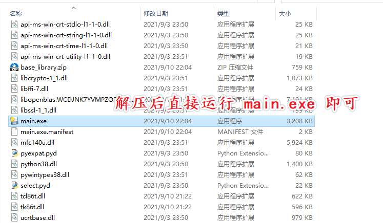

## 原神钓鱼辅助工具 v3.0.1 - 船新升级

> <div align="center"><b>「您只需抛出鱼竿，然后我们会帮您搞定一切」</b></div><br/>
> 
> * 如果你觉得这个脚本好用，请点一个 Star⭐，你的 Star 就是作者更新最大的动力
 
* 感谢 [@hgjazhgj](https://github.com/hgjazhgj) 提供使用 Alpha 通道的思路

* 感谢 [@SwetyCore](https://github.com/SwetyCore) 编写的无需管理员权限版本

#### 效果展示
 


#### 演示视频：

* [哔哩哔哩（链接挂了）](https://www.bilibili.com/video/BV1q64y1h7Wu)
  
* [YouTube](https://youtu.be/lhUBmbiG1Oc)

✨欢迎大家在 Issues 中分享自己的配置文件✨

✨也祝各位早日钓到精五鱼叉✨

### 更新内容：

* 将耗时操作放到单独的进程中执行，大幅提高运行效率

* 大部分电脑都可以使用 **Alpha 模式**提高检测的准确率（无法用于云游戏）

### 这个脚本有什么特色？

* 直接在游戏画面上通过叠加层显示信息，直截了当，便于调试

* 使用相对距离定位进度条，不会因为 ui 布局变化而影响检测效果

* 当配置文件正确时，**拥有接近 100% 的检测准确率**

* 可使用快捷键直接对**选区截图**，方便您构造自己的配置文件

### 使用教程：

#### 方式一：下载

> 💡 Release 版本（v2.0.3）现已发布，下载后直接解压即可使用，[点击这里](https://github.com/Mufanc/Genshin-SmartFishingRod/releases/latest) 跳转到下载页
> 
> 

#### 方式二：手动通过代码运行

* 首先下载项目代码到本地

```shell
git clone https://github.com/Mufanc/Genshin-SmartFishingRod.git
cd Genshin-SmartFishingRod
```

* 然后检查您的游戏设置中是否能选择 **1600x900** 这一尺寸的窗口

=> 有

> 1. 进入游戏设置，将画面大小改为 1600x900，此时游戏窗口应当没有边框
> 
> 2. 运行 `python main.py`（脚本会自动申请管理员权限）
> 
> 3. 选择合适位置抛下鱼竿，等待脚本自动完成钓鱼

=> 没有

> 很遗憾，现有的配置文件并不能完美支持你的电脑。但请不要灰心，您可以参照 [下面的教程](#关于-detectsyml) 构建自己的配置文件
 
### 快捷键

* <kbd>Alt + .</kbd> 
  
隐藏 / 显示叠加层（隐藏后**仍可**自动钓鱼）

* <kbd>Alt + 小键盘【1-9】</kbd> 
  
按叠加层上框定的区域对游戏进行截图，善用此功能可以很方便地创建自己的**模板文件**

* <kbd>Alt + 小键盘 0</kbd>

弹出一个窗口，可以在此快速划定一些检测区域，可以很方便地生成自己的**配置文件** **（尚未实现）**

### 关于 `detects.yml`

* 该配置文件中存储着一些图片检测和坐标查找相关的选项：

```yaml
# use for: 1600x900_dpi100_SMAA

templates:
  - name: button
    rect: { left: 0.83, top: 0.88, right: 0.13, bottom: 0.03 }  # 识别区域
    threshold: 0.95
    template: button.png

  - name: hook
    rect: { left: 0.49, top: 0.1, right: 0.49, bottom: 0.76 }
    threshold: 0.7
    template: hook.png

progress:
  # 进度条的相对宽高
  width: 0.26
  height: 0.027

  # 进度条中心点到鱼钩图案中心点的高度
  offset: 0.053

  # 其它相关设定
  frame-color: [ 180, 225, 225 ]  # BGR
  threshold: 0.035
  sp: [ 6, 18 ]

```

#### templates

描述了所有用于匹配的模板图片信息，其中每个元素的属性解释如下：

* **name**

该模板图片的名称

* **rect**

描述方式类似 css 中的 `position: fixed`，指定一个待识别的区域，其 `rect` 属性中按比例存储了区域的位置信息，比如游戏画面的左上四分之一范围可以表示为：

```yaml
rect: { left: 0, top: 0, right: 0.5, bottom: 0.5 }
```

* **threshold**

置信度阈值，当区域内最优匹配与模板相似度不小于此阈值时，认为匹配成功

* **template**

模板图片的文件名，注意模板图须放在模板文件夹下的 `images/` 文件夹下。**该属性为非必须指定**，当不指定时，脚本仅在游戏画面上标注对应区域以供使用快捷键截图，并不会做任何匹配

#### progress

* **width**、**height**

描述进度条的宽度和高度，均为关于游戏画面大小的相对表示（例如 `width: 0.5` 就是画面的一半宽）

* **offset**

进度条中心与「鱼钩」图标的相对距离

* **frame-color**

游标和滑框的主要颜色，**注意是按 BGR 表示**

* **threshold**

进度条的判定阈值，当 `frame-color` 在框定的区域内占比达到该阈值时，认为进度条已出现

* **sp**

一个二元数组，设某一横坐标 x 下 y 轴方向 `frame-color` 颜色像素数目为 n，则当 `sp[0] <= n < sp[1]` 时，认为这是滑框的左边界或右边界，而当 `n >= sp[1]` 时，则认为该位置是游标。用截图工具截图并设法放大计数，便可得到 sp 的最佳取值

### 无法使用 Alpha 模式时的一些调用技巧

* 将右下角检测上钩的区域置于水面偏蓝绿色背景上，检测鱼钩图样的黄色方框置于偏深色背景上，有助于提高检测效果

* 如果在雪山、踏鞴砂等特殊钓点出现无法自动收竿的情况，请尝试更改阈值或使用针对性的匹配图样

### 声明和警告

* 脚本需要管理员权限是因为**游戏以管理员权限启动**，若无管理员权限则无法模拟鼠标动作

* **脚本并未修改游戏内存及文件数据，而是类似连点器这样使用 PostMessage 向窗口发送鼠标事件，但仍然存在被检测到的可能，如果你很担心被封号，请不要使用该脚本**

## Todo

* [ ] 使用快捷键 <kbd>Alt + 0</kbd> 快速生成一个配置文件

* [ ] 添加更多的配置文件模板